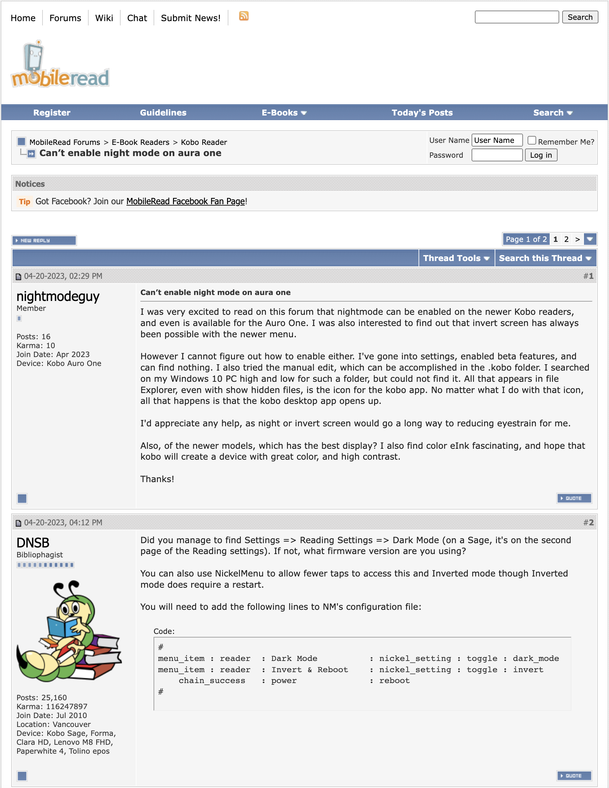
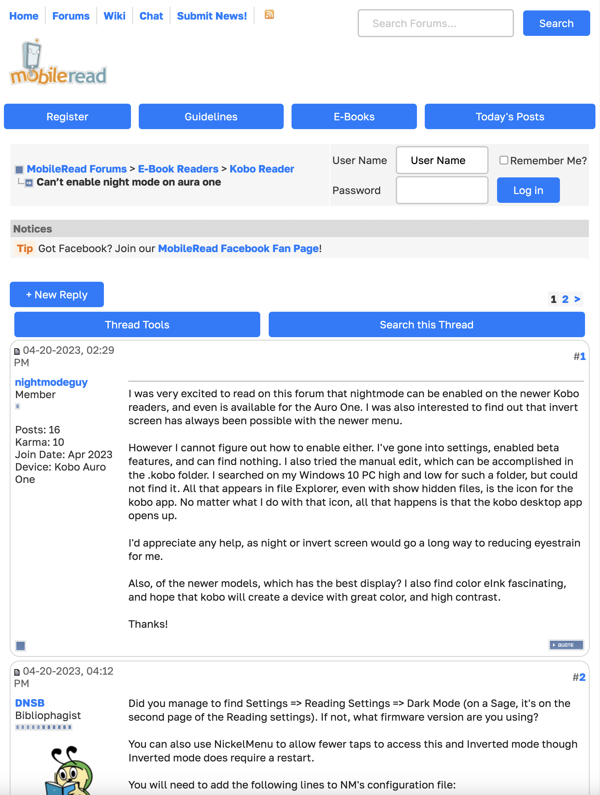

# AwesomeRead
Enhance MobileRead.com's styling!

The first image shows MobileRead.com before, and the second shows it after!

## Installation

I'm planning to publish this to the Chrome Web Store soon, but for now, download the source, enable Developer Mode in `chrome://extensions`, and click `Load Unpacked`. This should work with any Chromium-based browser. Firefox + Safari versions are coming soon!
## Todo
* Add highlight.js for code - it autodetects language
* Format "New Post" section
* Add more styling for the post lists/search results
* Better styling the homepage
* Style the "Menus" - e.g. "Forum Tools" or "Search this Forum" menu...
* Fix styling of the user who posted a post when not logged in
* Fix styling when editing post

## Bugs
Please create a GitHub issue to report bugs. Thank you!